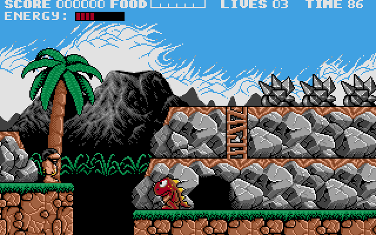

# Prehistorik for Haiku

[English](README.md)



DOS 게임 *Prehistorik*(Titus, 1991)을 Haiku에서 네이티브로 실행하는 포팅입니다.
게임의 원래 코드를 C로 변환해 Haiku 애플리케이션으로 컴파일하므로 DOS 에뮬레이터
없이 동작합니다. VGA 모드로 시작하며, AdLib 음악과 Sound Blaster 효과음을 Haiku
미디어 킷으로 재생하고, 키보드로 조작합니다.

**이 저장소에는 게임의 파일이나 코드가 들어 있지 않습니다.** DOS판 게임을 직접
가지고 있어야 합니다. 변환된 코드, 아이콘 등 게임에서 파생되는 것은 모두 사용자의 컴퓨터에서
사용자의 게임 파일로 생성됩니다.

## 준비물

* **Haiku PC**: 32비트 x86(x86_gcc2 hybrid)과 x86 개발 도구(`setarch x86`).
  Haiku R1/beta6 개발 빌드(hrev99002)에서 테스트했습니다.
* **Prehistorik DOS판 게임 파일** 다섯 개: `historik.exe`, `filesa.cur`,
  `filesa.vga`, `filesb.cur`, `filesb.vga`. `historik.exe`의 크기가
  164,166바이트인 판본을 기준으로 만들었습니다.
* **Python 3가 설치된 Linux, macOS 또는 Windows 컴퓨터**: `historik.exe`를 C로
  변환할 때 한 번 사용합니다. 변환기에 필요한 `iced-x86` 패키지는 Haiku에서 쓸 수
  없습니다.

## 1. 소스 받기

```sh
git clone https://github.com/rainygirl/haiku-prehistorik.git
cd haiku-prehistorik
```

## 2. 게임 코드 변환 (Linux, macOS 또는 Windows)

```sh
python3 -m pip install iced-x86
python3 tools/translate.py /path/to/prehistorik/historik.exe src/gen
```

`src/gen/`에 C 파일 약 70개가 생성됩니다. 사용자의 게임에서 만든 파일이므로 공개하지
마세요. `.gitignore`에 이미 제외되어 있습니다.

## 3. Haiku에서 빌드

`src/gen/`을 포함한 `haiku-prehistorik` 폴더 전체를 Haiku 컴퓨터로 복사한 뒤
터미널에서 실행합니다.

```sh
cd haiku-prehistorik
setarch x86 make GAME=/path/to/prehistorik
```

`GAME`은 게임 파일 다섯 개가 있는 폴더입니다. 빌드는 변환된 코드를 컴파일한 뒤,
창 없이 게임을 한 번 실행해 인트로 화면을 캡처하고, 원시인의 말풍선 속 고기 그림을
애플리케이션 아이콘으로 만듭니다. 느린 컴퓨터에서는 전체 빌드에 10분 정도 걸립니다.

## 4. 설치

```sh
setarch x86 make install GAME=/path/to/prehistorik
```

애플리케이션과 게임 파일을 `/boot/home/config/non-packaged/apps/Prehistorik`에
복사하고, Deskbar의 Applications 메뉴와 데스크톱에 Prehistorik을 추가합니다.

데스크톱에 Prehistorik 아이콘이 보이지 않거나 일반 파일 아이콘으로 보이면 Tracker가
예전 화면을 캐시하고 있는 것입니다. Tracker를 재시작하세요. Tracker 자신의 창만 닫힙니다.

```sh
hey Tracker quit; /boot/system/Tracker &
```

## 실행

Deskbar나 데스크톱에서 Prehistorik을 실행합니다. 빌드 결과를 바로 실행할 수도
있습니다.

```sh
build/Prehistorik /path/to/prehistorik/historik.exe
```

인자 없이 실행하면 애플리케이션과 같은 폴더에서 `historik.exe`를 찾습니다.

| 키 | 동작 |
| --- | --- |
| 왼쪽 / 오른쪽 | 이동 |
| 위 | 점프 |
| 아래 | 웅크리기, 동굴 들어가기 |
| 스페이스 | 몽둥이 휘두르기, 게임 시작 |
| Esc | 게임 종료 |

창 크기를 바꾸면 화면이 확대됩니다. 설치되는 `grawaga.cfg`는 영어, VGA,
Sound Blaster, 키보드를 선택해 두어 바로 인트로가 시작됩니다. 언어, 그래픽 모드,
사운드 장치, 조작 장치를 바꾸려면 터미널에서 원본 설정 화면으로 실행합니다.

```sh
/boot/home/config/non-packaged/apps/Prehistorik/Prehistorik --setup
```

## 라이선스

포팅의 고유한 코드는 MIT 라이선스로 공개합니다(`LICENSE` 참고). 제3자 구성 요소는
각자의 라이선스를 따릅니다. `src/ymfm`은 Aaron Giles의 ymfm(BSD 3-Clause)이고,
8x8 폰트는 Daniel Hepper의 퍼블릭 도메인 `font8x8`에서 가져왔습니다.
`THIRD_PARTY_NOTICES.md`를 참고하세요.

*Prehistorik*의 저작권은 1991 Titus Software에 있습니다. 게임의 파일과 코드는
이 저장소에 포함되어 있지 않으며, MIT 라이선스는 게임이나 게임에서 생성한 결과물에
적용되지 않습니다. `docs/screenshots/`의 이미지 두 장(게임 화면 스크린샷과 아이콘
미리보기)은 이 포팅을 소개하기 위해서만 게임의 그림을 보여 줍니다.

---

이 포팅은 AI(Anthropic의 Claude)의 도움을 받아 개발되었습니다.
